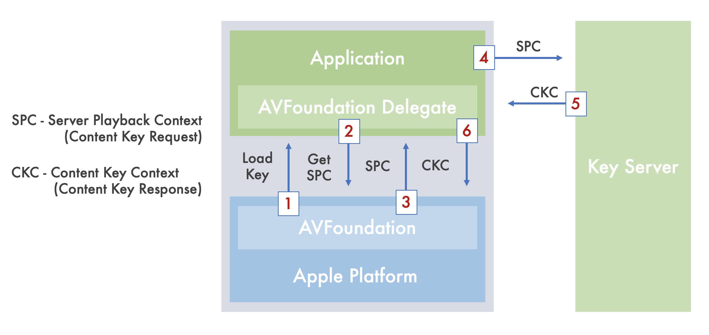
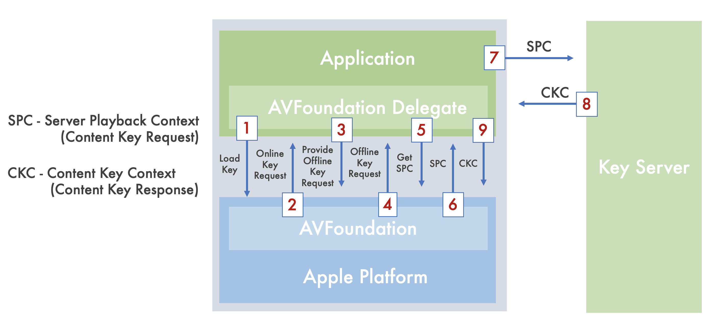
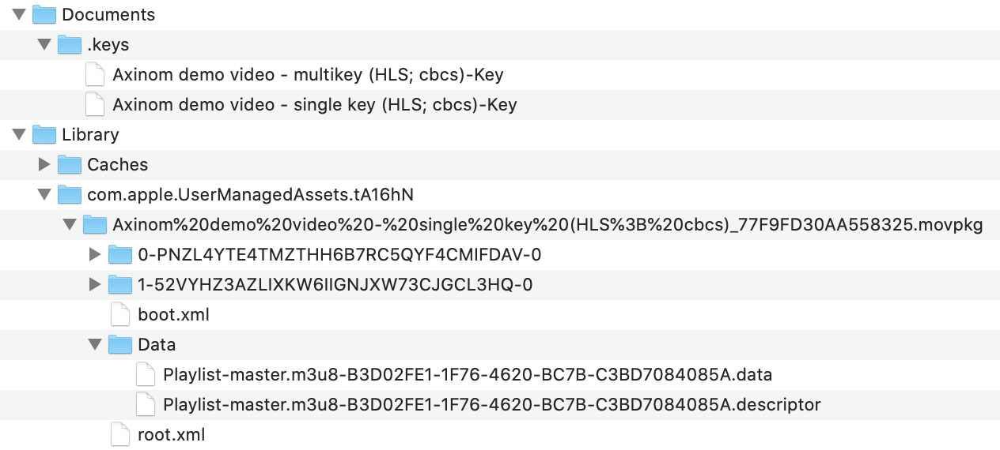

# Axinom DRM Sample Player
 
The purpose of this sample application is to provide a reference code that can help using Axinom DRM with AVFoundation framework to play FairPlay protected HTTP Live Streams (HLS) hosted on remote servers as well as giving an example of persisting FairPlay protected and non-protected HLS streams on disk for offline playback.
 
You can use the example code provided in this sample to build your own application that integrates the Axinom DRM with AVFoundation.
 
Another major usage of this sample raises from its capability of tracing the steps performed during the playback of protected and non-protected assets such as FairPlay content protection related activity, DRM license acquisition from Axinom DRM licensing server, as well as ```AVPlayerItem``` and ```AVPlayer``` statuses, buffer events, and Access log and Error log events associated with ```AVPlayerItem```.
 
Sample application's Player View has a togglable Console overlay, that allows user to observe verbose logging of these steps. Console output can be cleared and copied to the device clipboard. Player buttons behind the Console overlay can be clicked only when the Console overlay is hidden.
 
## Using the Sample application
 
Build and run the sample on an actual device running iOS 13.1 or later using Xcode.  The APIs demonstrated in this sample do not work on the iOS Simulator.
 
This sample provides a list of HLS Streams that you can playback by tapping on the UITableViewCell corresponding to the stream.  If you wish to cancel an already running `AVAggregateAssetDownloadTask` or delete an already downloaded HLS stream from disk, you can accomplish this by tapping on the accessory button on the `UITableViewCell` corresponding to the stream you wish to manage.
If you wish to download an HLS stream initiating an `AVAggregateAssetDownloadTask`, you can accomplish this by tapping the multifunction button (Save/Delete/Cancel) button on Player View Controller. Canceling and deleting downloaded stream actions are can also be performed on Player View Controller by tapping the multifunction button (Save/Delete/Cancel).
 
When the sample creates and initializes an `AVAggregateAssetDownloadTask` for the download of an HLS stream, only the default selections for each of the media selection groups will be used (these are indicated in the HLS playlist `EXT-X-MEDIA` tags by a DEFAULT attribute of YES).
 
### Adding Streams to the Sample
 
If you wish to add your own HLS streams to test with using this sample, you can do this by adding an entry into the Streams.json that is part of the Xcode Project.  There are two important keys you need to provide values for:
 
__title__: What the display name of the HLS stream should be in the sample, also used as a file name for the downloaded asset and for storage of the persistent key.
 
__videoUrl__: The URL of the HLS stream's master playlist.
 
__licenseServer__:  Axinom DRM License Server URL.
 
__fpsCertificateUrl__: FairPlay Streaming Certificate URL.
 
__licenseToken__:  License Token for Content Key Request.
 
### Application Transport Security
 
If any of the streams you add are not hosted securely, you will need to add an Application Transport Security (ATS) exception in the Info.plist.  More information on ATS and the relevant plist keys can be found in Apple documentation:
 
Information Property List Key Reference - NSAppTransportSecurity: <https://developer.apple.com/library/ios/documentation/General/Reference/InfoPlistKeyReference/Articles/CocoaKeys.html#//apple_ref/doc/uid/TP40009251-SW33>
 
## Important Notes
 
Saving HLS streams for offline playback is only supported for VOD streams.  If you try to save a live HLS stream, the system will throw an exception.
 
## Main Files
 
__AssetDownloader.swift__:
 
- `AssetDownloader` demonstrates how to manage the downloading of HLS streams. It includes APIs for starting and canceling downloads, deleting existing assets of the user's device, and monitoring the download progress and status.
 
__ContentKeyManager.swift__:
 
- `ContentKeyManager` class configures the instance of AVContentKeySession to use for requesting Content Keys securely for playback or offline use.
 
__PlayerViewController.swift__:
 
- The `PlayerViewController` uses a native AVPlayer as a base and provides a Video Player user interface together with capabilities of managing the downloading process, deleting downloaded media together with the Content Key associated with an asset. Togglable Console view allows user to see verbose logging of the steps performed during the playback of protected and non-protected assets, Fairplay content protection related activity, as well as AVPlayerItem and AVPlayer statuses, buffer events, and Access log and Error log events associated with AVPlayerItem. Console output can be cleared and copied to the device clipboard.
 
__Asset.swift__:
 
- `Asset` is a class that holds information about an Asset and adds its AVURLAsset as a recipient to the Playback Content Key Session in a protected playback/download use case. DownloadState extension is used to track the download states of Assets, Keys extension is used to define a number of values to use as keys in dictionary lookups.
 
<br>
 
## FairPlay Streaming Overview
 
This sample application allows to play protected and non-protected HTTP Live Streams and preserve them on disk for offline playback.
 
After the user requests playback of the protected HLS asset from AVFoundation m3u8 playlist will be downloaded from the Internet and parsed by AVFoundation.
 
 
### Online playback and key delivery scenario
 
The following image demonstrates further steps performed to playback FairPlay protected media in an online scenario.
 

 
<br>
 
### 1. App receives key loading request from AVFoundation
 
During parsing of the m3u8 playlist provided by the client, AVFoundation determines that the content is encrypted (m3u8 playlist contains KEY tag).
As a result ```AVContentKeySessionDelegate``` will provide ```AVContentKeyRequest``` object by invoking the following delegate callback.
```swift
func contentKeySession(_ session: AVContentKeySession, didProvide keyRequest: AVContentKeyRequest) {
 handleOnlineContentKeyRequest(keyRequest: keyRequest)
}
```
 
Received ```AVContentKeyRequest``` object will allow performing FairPlay streaming specific operations like creating SPC - Server Playback Context (Content Key Request) and then sending it to a Key Server. For sake of simplicity we can name SPC a Content Key Request.
 
### 2. App requests for a Content Key Request (SPC) from AVFoundation.
 
In ```handleOnlineContentKeyRequest``` method we check whether the Application Certificate is available, and if not, it will be requested from ```fpsCertificateUrl``` url, defined in Streams.json.
 
### 3. AVFoundation creates Content Key Request (SPC)
As a next step, in the ```provideOnlineKey(withKeyRequest: keyRequest, contentIdentifier: contentIdentifierData)``` method we ask AVFoundation to prepare a Content Key Request (SPC) for a specific combination of application and content (Content Identifier previously parsed from m3u8 playlist).
 
```swift
keyRequest.makeStreamingContentKeyRequestData(forApp: self.fpsCertificate,
                                  contentIdentifier: contentIdentifierData,
                                            options: [AVContentKeyRequestProtocolVersionsKey: [1]],
                                  completionHandler: completionHandler)
```
 
### 4. App sends Content Key Request (SPC) to a Key Server
 
Now in ```completionHandler``` Content Key Request (SPC) returned by ```makeStreamingContentKeyRequestData``` method will be sent to a Key Server.
 
```swift
let ckcData = try strongSelf.requestContentKeyFromKeySecurityModule(spcData: spcData)
```
 
### 5. Key Server responds back with Content Key Response (CKC)
 
Key Server responds back with CKC - Content Key Context, for sake of simplicity we can name it Content Key Response. ```AVContentKeyResponse``` class object will be used to represent the data returned from the Key Server.
```swift
let keyResponse = AVContentKeyResponse(fairPlayStreamingKeyResponseData: ckcData)
```
 
### 6. App provides Content Key Response (CKC) to AVFoundation
 
Now the app will provide the Content Key Response (CKC) to AVFoundation to make protected content available for processing.
 
```swift
keyRequest.processContentKeyResponse(keyResponse)
```
Finally, AVFoundation can start decryption and playback.
 
<br>

### License renewal

```AVContentKeyRequest``` provided by ```AVContentKeySessionDelegate``` (step 1 in the online playback and key delivery scenario) is saved and used for renewing the license using
```renewExpiringResponseData(for contentKeyRequest: AVContentKeyRequest)``` function. For renewing the license in the application, "Renew" button on Player View Controller has to be clicked.

<br>
 
### Key delivery for offline use
 
The following image demonstrates steps performed to deliver the persistable key that will be used to playback Fairplay protected content in an offline scenario.
 

 
 
### 1. The app initiates online key loading request from AVFoundation
 
Key loading process in initiated by calling ```processContentKeyRequest``` method on ```AVContentKeySession``` instance which in current sample app is wrapped into ```requestPersistableContentKeys``` method.
 
```swift
func requestPersistableContentKeys(forAsset asset: Asset) {   
 contentKeySession.processContentKeyRequest(withIdentifier: asset.contentKeyId,
                                          initializationData: nil,
                                                     options: nil)
}
```
 
### 2. AVFoundation responses with an online key loading request
 
Once this method is called ```AVContentKeySession``` will initiate online key loading first by invoking the following delegate callback
 
```swift
func contentKeySession(_ session: AVContentKeySession, didProvide keyRequest: AVContentKeyRequest) {       
       handleOnlineContentKeyRequest(keyRequest: keyRequest)
}
```
 
### 3. The app initiates a persistable key loading request
 
Once ```handleOnlineContentKeyRequest``` method is called, ```downloadRequestedByUser``` parameter previously set to true, will determine that initial intention was to initiate Persistable Content Key loading process. As a result Persistable Content Key will be initiated by ```respondByRequestingPersistableContentKeyRequestAndReturnError``` method:
 
```swift
keyRequest.respondByRequestingPersistableContentKeyRequestAndReturnError()
```
 
### 4. AVFoundation responses with a persistable key loading request
 
Once this method is called ```AVContentKeySession``` will send ```AVPersistableContentKeyRequest``` object by invoking the following delegate callback:
 
```swift
func contentKeySession(_ session: AVContentKeySession, didProvide keyRequest: AVPersistableContentKeyRequest) {
 handlePersistableContentKeyRequest(keyRequest: keyRequest)
}
```
 
Received AVPersistableContentKeyRequest object will allow performing FairPlay streaming specific operations like creating SPC - Server Playback Context (Content Key Request) and sending it to a Key Server.
 
### 5-6. AVFoundation creates Persistable Content Key Request (SPC)
 
In ```handlePersistableContentKeyRequest``` method we check whether the Application Certificate is available, and if not, it will be requested from ```fpsCertificateUrl``` URL, defined in Streams.json.
 
As a next step, we ask AVFoundation to prepare a Content Key Request (SPC) for a specific combination of application and content (Content Identifier parsed from m3u8 playlist).
 
```swift
keyRequest.makeStreamingContentKeyRequestData(forApp: self.fpsCertificate,
                                  contentIdentifier: contentIdentifierData,
                                            options: [AVContentKeyRequestProtocolVersionsKey: [1]],
                                  completionHandler: completionHandler)
```
 
### 7. App sends Content Key Request (SPC) to a Key Server
 
Now in ```completionHandler``` Content Key Request (SPC) returned by ```makeStreamingContentKeyRequestData``` method will be sent to a Key Server.
 
```swift
let ckcData = try strongSelf.requestContentKeyFromKeySecurityModule(spcData: spcData)
```
 
### 8. Key Server responses back with Content Key Response (CKC)
 
Upon receiving the Content Key Response - CKC is passed to AVFoundation to create a persistable content key, that will be used to decrypt Fairplay protected content in offline usage.
 
```swift
let persistentKey = try keyRequest.persistableContentKey(fromKeyVendorResponse: ckcData, options: nil)
```
 
Now Persistable Content Key is delivered and will be saved to the device.
 
```swift
try strongSelf.writePersistableContentKey(contentKey: persistentKey, withAssetName: strongSelf.asset.name)
```
 
### 9. App provides Content Key Response (CKC) to AVFoundation
 
```AVContentKeyResponse``` class object will be used to represent the data returned from the Key Server.
 
```swift
let keyResponse = AVContentKeyResponse(fairPlayStreamingKeyResponseData: ckcData)
```
 
Now the app will provide the Content Key Response (CKC) to AVFoundation to make protected content available for processing.
 
```swift
keyRequest.processContentKeyResponse(keyResponse)
```
 
The Persistable Content Key is now ready to be used to decrypt Fairplay protected content and AVFoundation start downloading the stream to the device.
 
For that ```.HasAvailablePersistableContentKey``` notification will be sent.
 
```swift
NotificationCenter.default.post(name: .HasAvailablePersistableContentKey, object: nil, userInfo: nil)
```
 
### Downloading the stream to the device
 
After dispatching the ```.HasAvailablePersistableContentKey``` notification corresponding ```handleContentKeyDelegateHasAvailablePersistableContentKey``` handler method will be called.
 
And if an asset is now already previously saved the downloading process will be initiated by
calling ```downloadStream()``` method, which is a wrapper to ```Downloader``` class method
 
```download(asset: Asset)```
 
 
All downloading related work is handled AVFoundation. Following classes are used for this purpose:
 
`AVAggregateAssetDownloadTask` - the sample creates and initializes an AVAggregateAssetDownloadTask for the download of an HLS stream. Only the default media selections for each of the asset’s media selection groups are downloaded (these are indicated in the HLS playlist EXT-X-MEDIA tags by a DEFAULT attribute of YES).
 
`AVAssetDownloadURLSession` - a URL session that supports the creation and execution of asset download tasks.
 
Following protocols are implemented to handle the download process:
 
<br>
 
### `AVAssetDownloadDelegate`
 
This protocol handles download-related events.
 
Following methods are implemented to notify the app of download progress, completion events, and download location:
 
* `urlSession(_:aggregateAssetDownloadTask:willDownloadTo:)`
The method asks the delegate for the asset download location.
 
**NOTE:** This delegate callback should only be used to save the location URL somewhere in your application. Any additional work should be done in `URLSessionTaskDelegate.urlSession(_:task:didCompleteWithError:)`.
 
* `urlSession(_:aggregateAssetDownloadTask:didLoad:totalTimeRangesLoaded:timeRangeExpectedToLoad:for:)`
Method to adopt to subscribe to progress updates of a download task
 
* `urlSession(_:aggregateAssetDownloadTask:didCompleteFor:)`
The method called when a child AVAssetDownloadTask completes for each media selection.
 
Find out more about `AVAssetDownloadDelegate`:
https://developer.apple.com/documentation/avfoundation/avassetdownloaddelegate
 
<br>
 
### `URLSessionTaskDelegate`
A protocol that defines methods that URL session instance calls on their delegates to handle task-level events.
 
The following method is implemented to notify the app that the task finished transferring data as well as to provide download related error handling:
 
* `urlSession(_:task:didCompleteWithError:)`
 
Find out more about `URLSessionTaskDelegate`:
https://developer.apple.com/documentation/foundation/urlsessiontaskdelegate

### Downloaded content folder structure

Downloaded content can be obtained and accessed as follows:
1. Open Devices and Simulators screen in Xcode (Window -> Devices and Simulators).
2. From the list of connected devices, choose the one that has Axinom DRM Sample
Player installed.
3. In the opened window under installed apps section, select Axinom DRM Sample
Player and then choose Download Container option accessible from the App
container actions menu indicated by three period signs at the bottom).
4. To view the downloaded application container, right click on it and select
Show Package Contents. While doing that, make sure that hidden files are shown
in Finder (shortcut: "Command + Shift + period" to toggle hiding/showing hidden
files) because some files or folders might not be visible otherwise.

The following screenshot shows how the downloaded file structure looks like on
an iOS device. Downloaded Fairplay keys are stored inside .keys folder. Audio
and video content is located under .movpkg folder. Contents of that can also be
viewed by right clicking on it and selecting the Show Package Contents option.
Video fragments are saved into a subfolder which name starts with "0" and the
audio fragments folder name starts with "1". The third folder named "Data"
contains the HLS master playlist. Finally, boot.xml describes the .movpkg
folder content.




## Helpful Resources

The following resources available on the Apple Developer website contain helpful information that you may find useful

* General information regarding HLS on supported Apple devices and platforms:
    * [HTTP Live Streaming (HLS) - Apple Developer](https://developer.apple.com/streaming/)
    * [AV Foundation - Apple Developer](https://developer.apple.com/av-foundation/)
* For information regarding topics specific to FairPlay Streaming as well as the latest version of the FairPlay Streaming Server SDK, please see:
    * [FairPlay Streaming - Apple Developer](http://developer.apple.com/streaming/fps/).
* Information regarding authoring HLS content for devices and platforms:
    * [HLS Authoring Specification for Apple Devices](https://developer.apple.com/library/content/documentation/General/Reference/HLSAuthoringSpec/index.html#//apple_ref/doc/uid/TP40016596-CH4-SW1)
    * [WWDC 2016 - Session 510: Validating HTTP Live Streams](https://developer.apple.com/videos/play/wwdc2016/510/)
    * [WWDC 2017 - Session 515: HLS Authoring Update](https://developer.apple.com/videos/play/wwdc2017/515/)
* Information regarding error handling on the server side and with AVFoundation on supported Apple devices and platforms:
    * [WWDC 2017 - Session 514: Error Handling Best Practices for HTTP Live Streaming](https://developer.apple.com/videos/play/wwdc2017/514/)
 

## Installing the sample application
 
The sample application can be downloaded from App Center by either navigating to the [website](https://install.appcenter.ms/orgs/ax/apps/axinom-drm-sample-player/distribution_groups/public) directly or by scanning this QR code with your device:
 

 
**NOTE:**
In order for the app to be available for use, you'll need to trust the developer's certificate. From your phone’s home screen, tap Settings > General > Profiles or Profiles & Device Management. Under the Enterprise App heading, you see will see a profile for the developer. Tap the name of the Axinom GmbH profile and then confirm you trust them. You can now launch the app.
 
## Requirements
 
### Build
 
Xcode 11.0 or later; iOS 13.0 SDK or later
 
### Runtime
 
iOS 13.1 or later.
